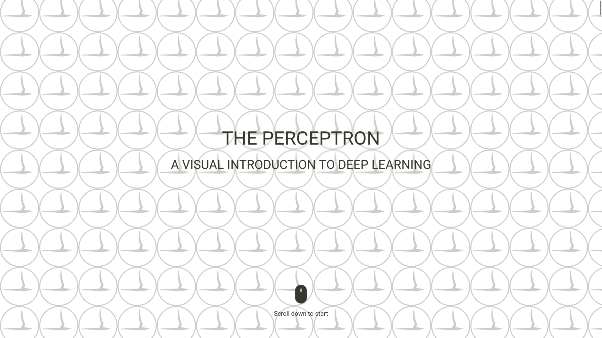

# The Perceptron: a Visual Introduction to Deep Learning



[🔗
gfabiani.codeberg.page/nn_intro/ ](https://gfabiani.codeberg.page/nn_intro/)

## Who is this for

_The Perceptron_ is an interactive Svelte + D3.js application that offers an introduction to the fundamental concepts of _Deep Learning_. It assumes no prior knowledge of the subject and is suitable for self-directed learning.

## Developers

> [!IMPORTANT]
> This project has been permanently moved to Codeberg. Read up about the [Give Up GitHub!](https://giveupgithub.org/) campaign.

### Quick start

Requirement: Node.js and npm should be installed on your system.

If you want to develop or adapt _The Perceptron_, or simply check out how it works under the hood, you can clone or fork this repository:

```{bash}
git clone https://codeberg.org/gfabiani/nn_intro.git
```

and then start the development server:

```{bash}
cd nn_intro
// install dependencies
npm install
// start development server
npm run dev
```

### Contributing

If you want to contribute, please open an issue on [Codeberg](https://codeberg.org/gfabiani/nn_intro/issues).

### Localization

Contact me (opening an issue on [Codeberg](https://codeberg.org/gfabiani/nn_intro/issues) or via email) if you want to translate _The Perceptron_ in your language.

## License

_The Perceptron_ is released as an open learning resource under the [CC BY-SA 4.0](https://creativecommons.org/licenses/by-sa/4.0/) license, which allows you to share, remix and transform the material for any purpose, even commercially, provided you **give appropriate credit** and **distribute your contribution under the same license as the original**.

Code for the application is licensed under [GPLv3](https://www.gnu.org/licenses/gpl-3.0.en.html).
